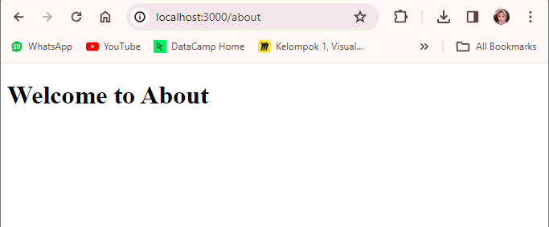

This is a [Next.js](https://nextjs.org/) project bootstrapped with [`create-next-app`](https://github.com/vercel/next.js/tree/canary/packages/create-next-app).

## Getting Started

First, run the development server:

```bash
npm run dev
# or
yarn dev
# or
pnpm dev
# or
bun dev
```

Open [http://localhost:3000](http://localhost:3000) with your browser to see the result.

You can start editing the page by modifying `app/page.tsx`. The page auto-updates as you edit the file.

This project uses [`next/font`](https://nextjs.org/docs/basic-features/font-optimization) to automatically optimize and load Inter, a custom Google Font.

## Praktikum 1
Berikut merupakan halaman Home:


Untuk menampilkan halaman abaout dengan mengubah routing menjadi `http://localhost:3000/about`


Berikum merupakan halaman profile


## Praktikum 2
Berikut merupakan halaman Main Blog:


Berikut merupakan halaman First Blog:


Berikut merupakan halaman Second Blog:


Pertanyaan : Apa kekurangan yang mungkin terjadi jika menggunakan pendekatan pada Praktikum 2 untuk menangani routing?

Jawaban:
Terdapat banyak kekurangan jika menggunakan nested routing, yaitu:
memiliki tingkat kompleksitas route yang tinggi, menyebabkan waktu loading lebih lama, meningkatkan kemungkinan kesalahan, dan kesulitan dalam pengujian dan pemeliharaan program.

## Praktikum 3
Berikut merupakan halaman products dengan mengimplementasikan Dynamic Routing


Todo 1: Perbaiki implementasi Praktikum 2 menggunakan Dynamic Routes

Yaitu dengan menghapus folder first dan second terlebih dahulu. Kemudian, membuat folder baru dengan nama `[urutanBlogs]` dan membuat file `page.tsx`. Lalu, menuliskan kode sebagai berikut:


Todo 2: Dengan menggunakan konsep Nested Routes dan Dynamic Routes, buatlah halaman dengan routing 
`/products/[productId]/reviews/[reviewId]`

Caranya adalah dengan membuat folder `reviews` di dalam folder `[productId]`. Kemudian di dalam folder `reviews` membuat folder baru dengan nama `[reviewId]` dan membuat file `page.tsx` didalamnya. Kemudian menulis kode dibawah ini pada file `page.tsx` sebagai berikut:


Hasil:


## Praktikum 4
Halaman Home:


Ketika klik link Profile, akan langsung membuka halaman Profile:


Ketika klik link About, akan langsung membuka halaman About:


